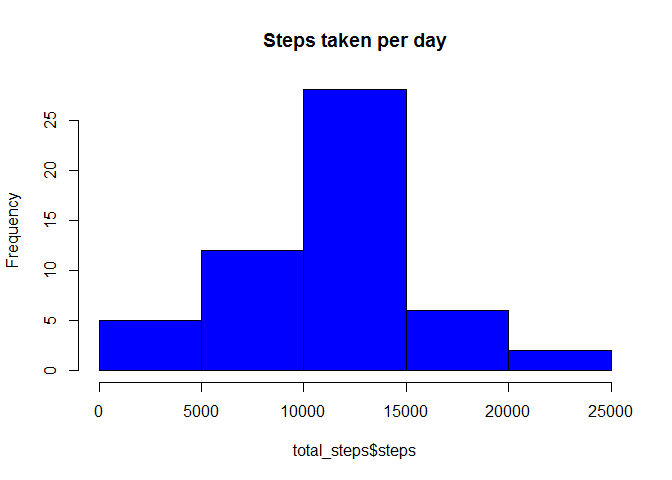
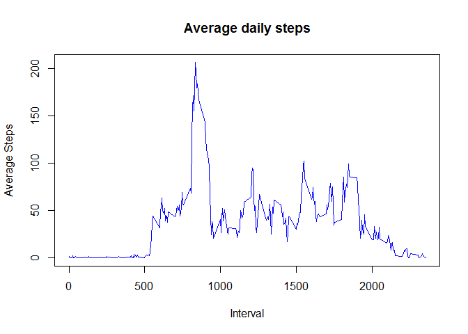
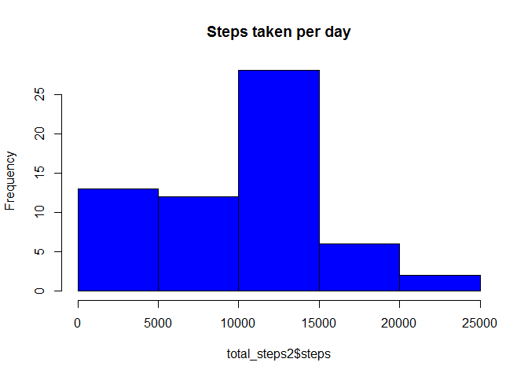
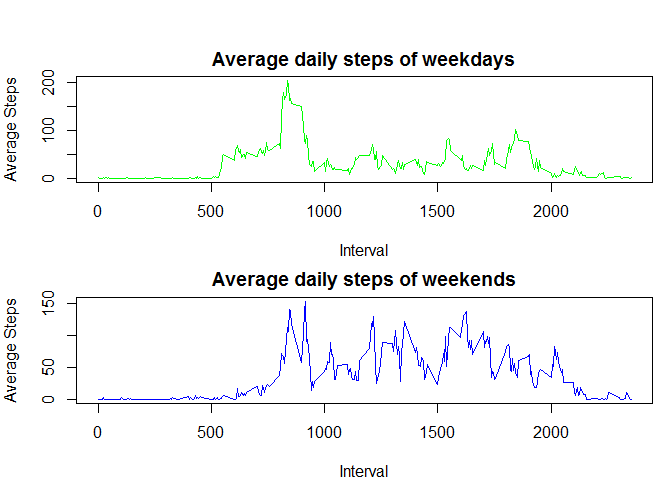

```r
sessionInfo()
```

```
## R version 3.4.1 (2017-06-30)
## Platform: x86_64-w64-mingw32/x64 (64-bit)
## Running under: Windows 7 x64 (build 7601) Service Pack 1
## 
## Matrix products: default
## 
## locale:
## [1] LC_COLLATE=English_United States.1252 
## [2] LC_CTYPE=English_United States.1252   
## [3] LC_MONETARY=English_United States.1252
## [4] LC_NUMERIC=C                          
## [5] LC_TIME=English_United States.1252    
## 
## attached base packages:
## [1] stats     graphics  grDevices utils     datasets  methods   base     
## 
## loaded via a namespace (and not attached):
##  [1] compiler_3.4.1  backports_1.1.2 magrittr_1.5    rprojroot_1.3-2
##  [5] tools_3.4.1     htmltools_0.3.6 yaml_2.1.18     Rcpp_0.12.16   
##  [9] stringi_1.1.7   rmarkdown_1.9   knitr_1.20      stringr_1.3.0  
## [13] digest_0.6.15   evaluate_0.10.1
```
---
title: "Reproducible Reasearch: Project 1"
output: html_document
---
## 1. Loading and preprocessing the data

1. Load the data (i.e. read.csv())
2. Process/transform the data (if necessary) into a format suitable for your analysis


```r
knitr::opts_chunk$set(echo = TRUE)
file_dir <- "C:/Google Drive/Coursera - Data Science/04 Reproducible Research/proj1"
file_name <- "activity.csv"
    
setwd(file_dir)
library(data.table)
```

```
## Warning: package 'data.table' was built under R version 3.4.3
```

```r
DT <- fread(input = file_name, sep = ",")
```

## 2. What is mean total number of steps taken per day?

1. Calculate the total number of steps taken per day
2. If you do not understand the difference between a histogram and a barplot, research the difference between them. Make a histogram of the total number of steps taken each day
3. Calculate and report the mean and median of the total number of steps taken per day


```r
dim(DT)
```

```
## [1] 17568     3
```

```r
names(DT)
```

```
## [1] "steps"    "date"     "interval"
```

```r
str(DT)
```

```
## Classes 'data.table' and 'data.frame':	17568 obs. of  3 variables:
##  $ steps   : int  NA NA NA NA NA NA NA NA NA NA ...
##  $ date    : chr  "2012-10-01" "2012-10-01" "2012-10-01" "2012-10-01" ...
##  $ interval: int  0 5 10 15 20 25 30 35 40 45 ...
##  - attr(*, ".internal.selfref")=<externalptr>
```

```r
summary(DT)
```

```
##      steps            date              interval     
##  Min.   :  0.00   Length:17568       Min.   :   0.0  
##  1st Qu.:  0.00   Class :character   1st Qu.: 588.8  
##  Median :  0.00   Mode  :character   Median :1177.5  
##  Mean   : 37.38                      Mean   :1177.5  
##  3rd Qu.: 12.00                      3rd Qu.:1766.2  
##  Max.   :806.00                      Max.   :2355.0  
##  NA's   :2304
```

```r
total_steps <- DT[, c(lapply(.SD, sum)), 
                  .SDcols = c("steps"), 
                  by = date]
head(total_steps)     #1. Steps taken per day
```

```
##          date steps
## 1: 2012-10-01    NA
## 2: 2012-10-02   126
## 3: 2012-10-03 11352
## 4: 2012-10-04 12116
## 5: 2012-10-05 13294
## 6: 2012-10-06 15420
```

```r
hist(total_steps$steps, 
     col = "blue",
     main = "Steps taken per day")  #2. Histogram
```

<!-- -->

```r
total_steps[, .(mean_steps = mean(steps, na.rm = TRUE), 
                median_steps = median(steps, na.rm = TRUE))]   #3. Mean and median steps per day
```

```
##    mean_steps median_steps
## 1:   10766.19        10765
```

## 3. What is the average daily activity pattern?

1. Make a time series plot (i.e. type="1") of the 5-minute interval (x-axis) and the average number of steps taken, averaged across all days (y-axis)
2. Which 5-minute interval, on average across all the days in the dataset, contains the maximum number of steps?


```r
ts_DT <- DT[, c(lapply(.SD, mean, na.rm = TRUE)), 
              .SDcols = c("steps"), 
              by = interval]
plot(ts_DT, 
     type="l", 
     main="Average daily steps", 
     xlab="Interval",
     ylab='Average Steps', 
     col = "blue")      #1. Time series
```

<!-- -->

```r
ts_DT[steps == max(steps), .(max_interval = interval)] #2. Interval with max steps 
```

```
##    max_interval
## 1:          835
```

## 4. Imputing missing values

1. Calculate and report the total number of missing values in the dataset (i.e. the total number of rows with NAs)
2. Devise a strategy for filling in all of the missing values in the dataset. The strategy does not need to be sophisticated. For example, you could use the mean/median for that day, or the mean for that 5-minute interval, etc.
3. Create a new dataset that is equal to the original dataset but with the missing data filled in.
4. Make a histogram of the total number of steps taken each day and calculate and report the mean and median total number of steps taken per day. Do these values differ from the estimates from the first part of the assignment? What is the impact of imputing missing data on the estimates of the total daily number of steps?


```r
DT[is.na(steps), .N]    #1. Number of missing values
```

```
## [1] 2304
```

```r
DT[is.na(steps), "steps"] <- DT[, c(lapply(.SD, median, na.rm = TRUE)), .SDcols = c("steps")]       #2. Filling in with the median

data.table::fwrite(x = DT, file = "activity_filled.csv", quote = FALSE)     #3. New dataset

file_name <- "activity_filled.csv"
DT2 <- fread(input = file_name, sep = ",")
dim(DT2)
```

```
## [1] 17568     3
```

```r
names(DT2)
```

```
## [1] "steps"    "date"     "interval"
```

```r
str(DT2)
```

```
## Classes 'data.table' and 'data.frame':	17568 obs. of  3 variables:
##  $ steps   : int  0 0 0 0 0 0 0 0 0 0 ...
##  $ date    : chr  "2012-10-01" "2012-10-01" "2012-10-01" "2012-10-01" ...
##  $ interval: int  0 5 10 15 20 25 30 35 40 45 ...
##  - attr(*, ".internal.selfref")=<externalptr>
```

```r
summary(DT2)
```

```
##      steps            date              interval     
##  Min.   :  0.00   Length:17568       Min.   :   0.0  
##  1st Qu.:  0.00   Class :character   1st Qu.: 588.8  
##  Median :  0.00   Mode  :character   Median :1177.5  
##  Mean   : 32.48                      Mean   :1177.5  
##  3rd Qu.:  0.00                      3rd Qu.:1766.2  
##  Max.   :806.00                      Max.   :2355.0
```

```r
total_steps2 <- DT2[, c(lapply(.SD, sum)), 
                  .SDcols = c("steps"), 
                  by = date]
head(total_steps2)     #4. Steps taken per day
```

```
##          date steps
## 1: 2012-10-01     0
## 2: 2012-10-02   126
## 3: 2012-10-03 11352
## 4: 2012-10-04 12116
## 5: 2012-10-05 13294
## 6: 2012-10-06 15420
```

```r
hist(total_steps2$steps, 
     col = "blue",
     main = "Steps taken per day")  #4. Histogram
```

<!-- -->

```r
total_steps2[, .(mean_steps = mean(steps), 
                median_steps = median(steps))]   #4. Mean and median
```

```
##    mean_steps median_steps
## 1:    9354.23        10395
```

## 5. Are there differences in activity patterns between weekdays and weekends?

For this part the weekdays() function may be of some help here. Use the dataset with the filled-in missing values for this part.
1. Create a new factor variable in the dataset with two levels - "weekday" and "weekend" indicating whether a given date is a weekday or weekend day.
2. Make a panel plot containing a time series plot (i.e. type="1") of the 5-minute interval (x-axis) and the average number of steps taken, averaged across all weekday days or weekend days (y-axis).


```r
DT2[, date := as.POSIXct(date, format = "%Y-%m-%d")]
DT2[, day := weekdays(x = date)]
DT2[grepl(pattern = "Monday|Tuesday|Wednesday|Thursday|Friday", x = day), "type"] <- "weekday"
DT2[grepl(pattern = "Saturday|Sunday", x = day), "type"] <- "weekend"   
head(DT2)   #1. Create weekday/weekend factor
```

```
##    steps       date interval    day    type
## 1:     0 2012-10-01        0 Monday weekday
## 2:     0 2012-10-01        5 Monday weekday
## 3:     0 2012-10-01       10 Monday weekday
## 4:     0 2012-10-01       15 Monday weekday
## 5:     0 2012-10-01       20 Monday weekday
## 6:     0 2012-10-01       25 Monday weekday
```

```r
wkday <- DT2[DT2$type == "weekday"]
wkend <- DT2[DT2$type == "weekend"]

ts_wkday <- wkday[, c(lapply(.SD, mean, na.rm = TRUE)), 
            .SDcols = c("steps"), 
            by = interval]

ts_wkend <- wkend[, c(lapply(.SD, mean, na.rm = TRUE)), 
                  .SDcols = c("steps"), 
                  by = interval]

par(mfrow = c(2, 1), mar = c(4, 4, 2, 1), oma = c(0, 0, 2, 0))

plot(ts_wkday, 
     type="l", 
     main="Average daily steps of weekdays", 
     xlab="Interval",
     ylab='Average Steps', 
     col = "green")      #1. Time series

plot(ts_wkend, 
     type="l", 
     main="Average daily steps of weekends", 
     xlab="Interval",
     ylab='Average Steps', 
     col = "blue")      #1. Time series
```

<!-- -->
